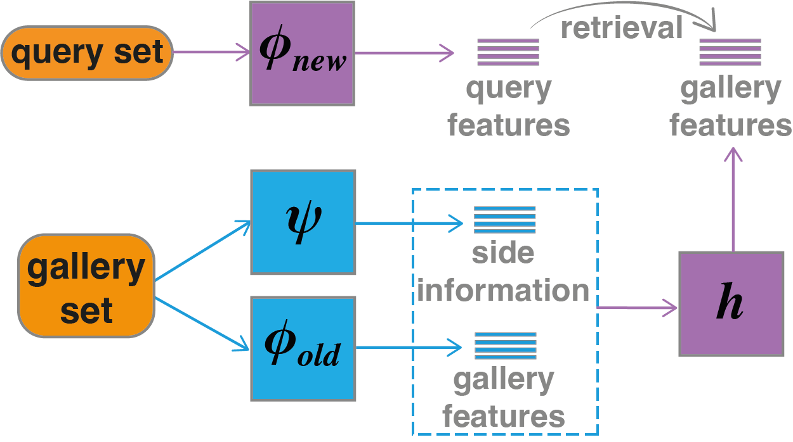
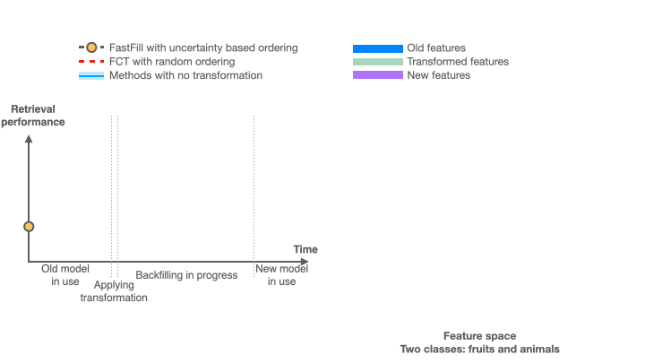

# Compatibility for Machine Learning Model Update
This repository contains PyTorch implementation of [Forward Compatible Training for Large-Scale Embedding Retrieval Systems (CVPR 2022)](https://arxiv.org/abs/2112.02805):



and [FastFill: Efficient Compatible Model Update (ICLR 2023)](https://openreview.net/pdf?id=rnRiiHw8Vy):



**The code is written to use Python 3.8 or above.**

## Requirements

We suggest you first create a virtual environment and install dependencies in the virtual environment.

```bash
# Go to repo
cd <path/to/ml-fct>
# Create virtual environment ...
python -m venv .venv
# ... and activate it
source .venv/bin/activate
# Upgrade to the latest versions of pip and wheel
pip install -U pip wheel
pip install -r requirements.txt
```

## CIFAR-100 Experiments (quick start)


We provide CIFAR-100 experiments, for fast exploration. The code will run and produce results of both FCT and Fastfill.
Here are the sequence of commands for CIFAR-100 experiments (similar to ImageNet but faster cycles):

```bash
# Get data: following command put data in data_store/cifar-100-python
python prepare_dataset.py

# Train old embedding model:
# Note: config files assume training with 8 GPUs. Modify them according to your environment.
python train_backbone.py --config configs/cifar100_backbone_old.yaml

# Evaluate the old model (single GPU is OK):
python eval.py --config configs/cifar100_eval_old_old.yaml

# Train New embedding model:
python train_backbone.py --config configs/cifar100_backbone_new.yaml

# Evaluate the new model (single GPU is OK):
python eval.py --config configs/cifar100_eval_new_new.yaml

# Download pre-traianed models if training with side-information:
source get_pretrained_models.sh

# Train FCT transformation:
# If training with side-info model, add its path to the config file below. You
# can use the same side-info model as for ImageNet experiment here. 
python train_transformation.py --config configs/cifar100_fct_transformation.yaml

# Evaluate transformed model vs new model (single GPU is OK):
python eval.py --config configs/cifar100_eval_old_new_fct.yaml

# Train FastFill transformation:
python train_transformation.py --config configs/cifar100_fastfill_transformation.yaml

# Evaluate transformed model vs new model (single GPU is OK):
python eval.py --config configs/cifar100_eval_old_new_fastfill.yaml
```

### CIFAR-100 (FCT, without backfilling):
* These results are *not* averaged over multiple runs.

| Case                                                  | `Side-Info`  |  `CMC Top-1 (%)`   | `CMC Top-5 (%)` |  `mAP (%)`  |
|-------------------------------------------------------|:------------:|:------------------:|:---------------:|:---------:|
| [old/old](./configs/cifar100_backbone_old.yaml)       |     N/A      |        34.2        |      60.6       |   16.5    |
| [new/new](./configs/cifar100_backbone_new.yaml)       |     N/A      |        56.5        |      77.0       |   36.3    |
| [FCT new/old](./configs/cifar100_transformation.yaml) |      No      |        47.2        |      72.6       |   25.8    |
| [FCT new/old](./configs/cifar100_transformation.yaml) |     Yes      |        50.2        |      73.7       |   32.2    |

### CIFAR-100 (FastFill, with backfilling):
* These results are *not* averaged over multiple runs.
* AUC: Area Under the backfilling Curve. For old/old and new/new we report performance corresponding to 
no model update and full model update, respectively. 

| Case                                                           | `Side-Info` | `Backfilling` | `AUC CMC Top-1 (%)` | `AUC CMC Top-5 (%)` | `AUC mAP (%)` |
|----------------------------------------------------------------|:-----------:|:-------------:|:-------------------:|:-------------------:|:-------------:|
| [old/old](./configs/cifar100_backbone_old.yaml)                |     N/A     |      N/A      |        34.2         |        60.6         |     16.5      |
| [new/new](./configs/cifar100_backbone_new.yaml)                |     N/A     |      N/A      |        56.5         |        77.0         |     36.3      |
| [FCT new/old](./configs/cifar100_fct_transformation.yaml)      |     No      |    Random     |        49.1         |        73.6         |     29.1      |
| [FastFill new/old](./configs/cifar100_fct_transformation.yaml) |     No      |  Uncertainty  |        53.6         |        75.3         |     32.5      |


## ImageNet-1k Experiments

Here are the sequence of commands for ImageNet experiments:

```bash
# Get data: Prepare full ImageNet-1k dataset and provide its path in all config
# files. The path should include training and validation directories. 

# Train old embedding model:
# Note: config files assume training with 8 GPUs. Modify them according to your environment.
python train_backbone.py --config configs/imagenet_backbone_old.yaml

# Evaluate the old model:
python eval.py --config configs/imagenet_eval_old_old.yaml

# Train New embedding model:
python train_backbone.py --config configs/imagenet_backbone_new.yaml

# Evaluate the new model:
python eval.py --config configs/imagenet_eval_new_new.yaml

# Download pre-traianed models if training with side-information:
source get_pretrained_models.sh

# Train FCT transformation:
# (If training with side-info model, add its path to the config file below.)
python train_transformation.py --config configs/imagenet_fct_transformation.yaml

# Evaluate transformed model vs new model:
python eval.py --config configs/imagenet_eval_old_new_fct.yaml

# Train FastFill transformation:
python train_transformation.py --config configs/imagenet_fastfill_transformation.yaml

# Evaluate transformed model vs new model:
python eval.py --config configs/imagenet_eval_old_new_fastfill.yaml
```

### ImageNet-1k (FCT, without backfilling):

| Case                                                  | `Side-Info` | `CMC Top-1 (%)` | `CMC Top-5 (%)` | `mAP (%)` |
|-------------------------------------------------------|:-----------:|:---------------:|:---------------:|:-------:|
| [old/old](./configs/imagenet_backbone_old.yaml)       |     N/A     |      46.4       |      65.1       |  28.3   |
| [new/new](./configs/imagenet_backbone_new.yaml)       |     N/A     |      68.4       |      84.7       |  45.6   |
| [FCT new/old](./configs/imagenet_transformation.yaml) |     No      |      61.8       |      80.5       |  39.9   |
| [FCT new/old](./configs/imagenet_transformation.yaml) |     Yes     |      65.1       |      82.7       |  44.0   |

### ImageNet-1k (FastFill, with backfilling):
* AUC: Area Under the backfilling Curve. For old/old and new/new we report performance corresponding to 
no model update and full model update, respectively. 

| Case                                                                | `Side-Info` | `Backfilling` | `AUC CMC Top-1 (%)` | `AUC CMC Top-5 (%)` | `AUC mAP (%)` |
|---------------------------------------------------------------------|:-----------:|:-------------:|:-------------------:|:-------------------:|:------------:|
| [old/old](./configs/imagenet_backbone_old.yaml)                     |     N/A     |      N/A      |        46.6         |        65.2         |     28.5     |
| [new/new](./configs/imagenet_backbone_new.yaml)                     |     N/A     |      N/A      |        68.2         |        84.6         |     45.3     |
| [FCT new/old](./configs/imagenet_fct_transformation.yaml)           |     No      |    Random     |        62.8         |        81.1         |     40.5     |
| [FastFill new/old](./configs/imagenet_fastfill_transformation.yaml) |     No      |  Uncertainty  |        66.5         |        83.6         |     44.8     |
| [FCT new/old](./configs/imagenet_fct_transformation.yaml)           |     Yes     |   Random      |        64.7         |        82.4         |     42.6     |
| [FastFill new/old](./configs/imagenet_fastfill_transformation.yaml) |     Yes     |  Uncertainty  |         67.8        |        84.2         |     46.2     |

## Contact

* **Hadi Pouransari**: mpouransari@apple.com

## Citation

```bibtex
@article{ramanujan2022forward,
  title={Forward Compatible Training for Large-Scale Embedding Retrieval Systems},
  author={Ramanujan, Vivek and Vasu, Pavan Kumar Anasosalu and Farhadi, Ali and Tuzel, Oncel and Pouransari, Hadi},
  journal={Proceedings of the IEEE conference on computer vision and pattern recognition},
  year={2022}
}

@inproceedings{jaeckle2023fastfill,
  title={FastFill: Efficient Compatible Model Update},
  author={Jaeckle, Florian and Faghri, Fartash and Farhadi, Ali and Tuzel, Oncel and Pouransari, Hadi},
  booktitle={International Conference on Learning Representations}
  year={2023}
}
```
